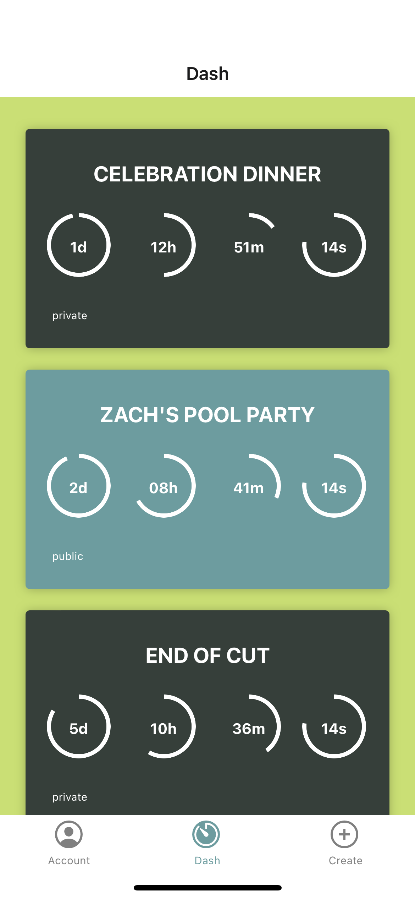

# ⌛OUR-GLASS | Keep Track & Share 
Interactive MERN SPA Project || Project 3 | group 7

## Project Objective 💭:
We attempted to insert everything that we learned throughout this course to create a MERN stack single-page application that works with real-world data to solve a real-world challenge, which is a social time management database that focuses on the users' demands.

## Description 🗒️:
Our-Glass is a multifunction countdown app, that allows the user to keep track of upcoming personal or shared events.

## User-Story 📓:
As a busy person, I'd like to have an app that keeps me in check with the things that are going on in my everyday life and be able to catch up with my freinds and familys' occassions.

## Built With 💻:
React
React Native
Expo
GraphQL
Expo
Javascript
Mongoose
MongoDB
Node.js
Express

## Screenshot 📸:

## Website 🖱️:
## Directión For Future Development 🕶:
## Contribution 👨‍💻:
#### Nicolas Y.
#### Brandon H.
#### Antony Q.
#### Mark E.
#### Vivianna M.